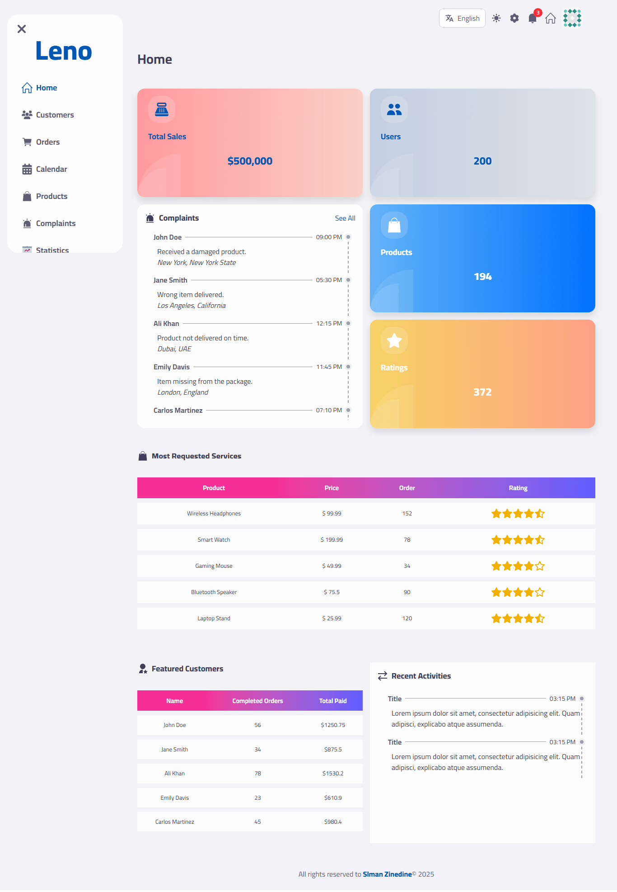

# Leno Dashboard

Leno Dashboard is a modern and versatile web application for managing and visualizing data efficiently. Designed for administrators and supervisors, it features an intuitive interface, supports multiple languages, and includes light and dark themes.

## Features

- **User Roles**: Dedicated views and functionalities for Admin and Supervisor roles.
- **Data Filtering**: Filter data in tables by name or status for quick access to relevant information.
- **Form Handling and Validation**: Streamlined form handling using `react-hook-form`, with schema-based validation powered by `zod`.
- **Data Fetching**: Efficient data fetching and caching using `Redux Toolkit Query`, ensuring optimal performance and minimal network requests.
- **Comprehensive Pages**: Includes pages for statistics, settings, and more.
- **Multilingual Support**: Supports English and Arabic using `react-i18next`.
- **Modern UI**: Built with the latest version of React (v19) and Tailwind CSS (v4) for a sleek and responsive design.
- **Light and Dark Themes**: Seamlessly switch between light and dark modes.

### Pages

Here are the key pages available in the dashboard:

- **Authentication**: `/login`, `change-password`
- **Home**: `/`
- **Error Handling**: `/not-found`, `/error`
- **Profiles**:
  - Admin Profile: `/admin-profile`
  - Supervisor Profile: `/supervisor-profile`
  - Company Profile: `/company-profile`
- **Users**:
  - Customers: `/customers`
  - Employees: `/employees`
  - Supervisors: `/supervisors`
- **Other Pages**:
  - Orders: `/orders`
  - Calendar: `/calendar`
  - Categories: `/categories`
  - Products: `/products`
  - Complaints: `/complaints`
  - Statistics: `/statistics`
  - Roles: `/roles`
  - Settings: `/settings`

## Project Demo and Repository

- **Demo**: [View the demo](https://slmanzinedine.vercel.app/)
- **Repository**: [Visit the GitHub repository](https://leno-dashboard.vercel.app/)

## Installation

1. Clone the repository:

   ```bash
   git clone https://github.com/slmanZineDine/Leno-Dashboard.git
   cd Leno-Dashboard
   ```

2. Install dependencies:

   ```bash
   npm install
   ```

3. Run the development server:
   ```bash
   npm run dev
   ```

## API Usage

This project uses [DummyJSON](https://dummyjson.com) as a fake API for development purposes. It provides mock data to simulate real-world scenarios, helping to build and test functionalities effectively.

## Usage

Leno Dashboard provides an intuitive platform for managing and visualizing data. Here's how you can utilize its core functionalities:

1. **Login**: Access the application through the login page (`/login`) to get started.
2. **Navigate Pages**:
   - Manage users (Customers, Employees, Supervisors) from their respective sections.
   - Handle operations such as Orders, Categories, and Products efficiently.
   - Utilize the Statistics page for performance insights and the Calendar for scheduling.
3. **Personalization**:
   - Switch between light and dark themes based on your preference.
   - Adjust settings and configurations in the Settings section (`/settings`).
4. **Language Support**: Seamlessly switch between English and Arabic for a localized experience.
5. **Error Management**: Encounter pages like `/error` and `/not-found` for handling issues gracefully.

Explore and manage organizational data with ease using these features!

## Screenshots



## License

This project is open source and available under the [MIT License](LICENSE).
